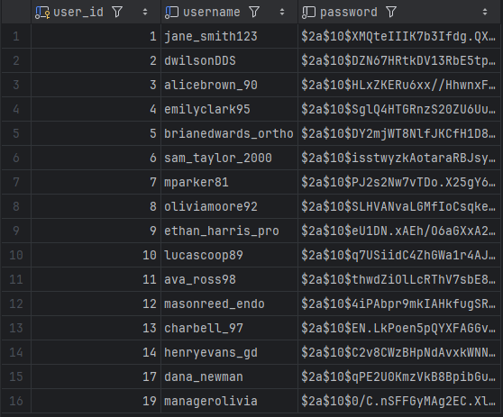
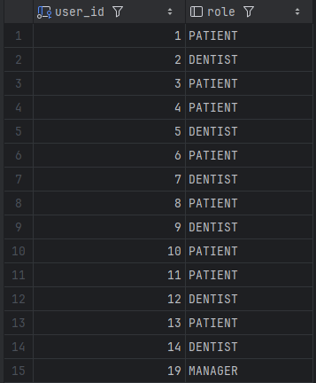
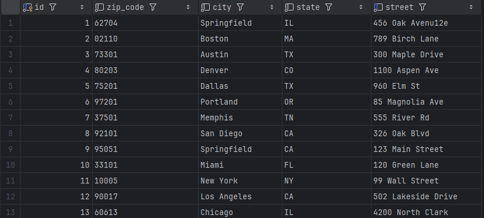
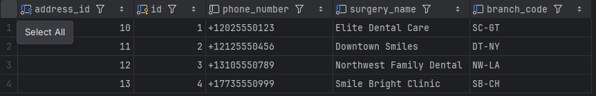
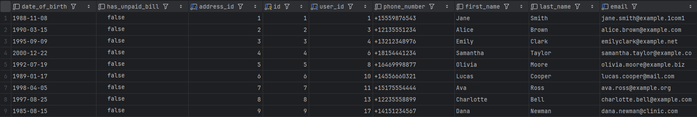
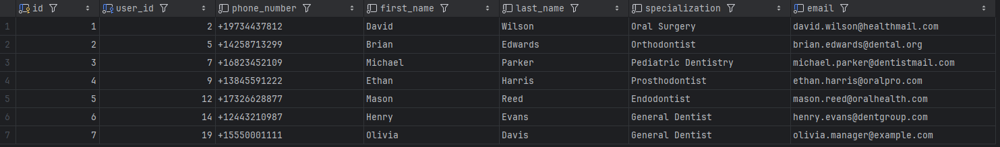
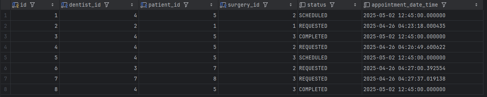

# Dental Surgery Management System

A modern, robust, and extensible web application for managing dental clinic operations. 
This project provides a full suite of features for patient records, appointments, dentists, 
enabling small to medium dental practices to manage their workflow efficiently.

## Features

- **Patient Management:**  
  Create, update, and view patients, including profile details, contact info.

- **Dentist Management:**  
  Manage dentist users, including specialization, profile, and appointments.

- **Appointment Scheduling:**  
  Create, update, cancel, and search appointments for patients and dentists, with support for pagination, filtering, and status tracking.

- **User Authentication & Authorization:**  
  Secure login system with JWT protection and role-based access control.

- **Billing & Payments:**  
  Track patients’ unpaid bills and manage payment status (future enhancement ideas).

- **RESTful API:**  
  All business logic is exposed through clean REST endpoints, ready for UI or external system integration.

- **Validation & Error Handling:**  
  Uses Jakarta Bean Validation and structured error responses for all endpoints.

## Architecture Diagram


## Stack

- **Backend:** Java 21, Spring Boot, Spring Data JPA, Spring Security, Lombok, Jakarta EE
- **Database:** (Pluggable, defaults to H2/postgres/MySQL depending on profile)
- **Build Tool:** Gradle 
- **Testing:** JUnit 5, Mockito, MockMvc
- **API Docs:** OpenAPI/Swagger (planned)

## Getting Started

### Prerequisites

- Java 21+ 
- Docker (for local DB, optional)
- Gradle or Maven

### Running Locally

1. **Clone the repository**
    ```shell
    git clone git@github.com:shresthabikash22/DentalSurgeryMS.git
    cd dentalsurgeryms
    ```
2. **Build and run**
    ```shell
    ./gradlew bootRun
    ```
   or if you use Maven:
    ```shell
    ./mvnw spring-boot:run
    ```

## Postman APIs
I have attached some screenshots of Postman in /images folder. For more, visit here:  
&nbsp;&nbsp;&nbsp; https://.postman.co/workspace/My-Workspace~419cc1ff-2204-46c7-85aa-c222fcfc5949/collection/14423516-cbecbbcc-6a3e-4edc-9b91-e5e63acd5953?action=share&creator=14423516&active-environment=14423516-7904d1a1-e874-4ce7-b244-8cc7a93cc329
  
### Table Data

#### user table

#### user_roles table

#### address table

#### surgery table

#### patient table

#### dentist table

#### appointment table


    

